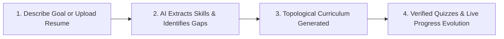
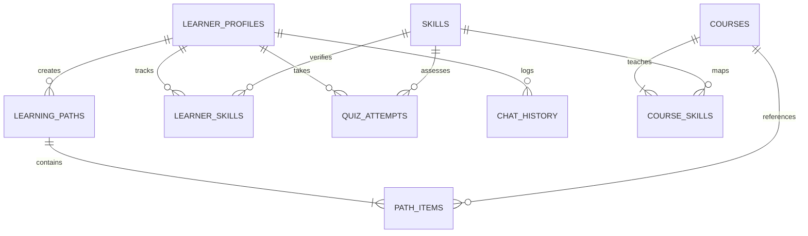
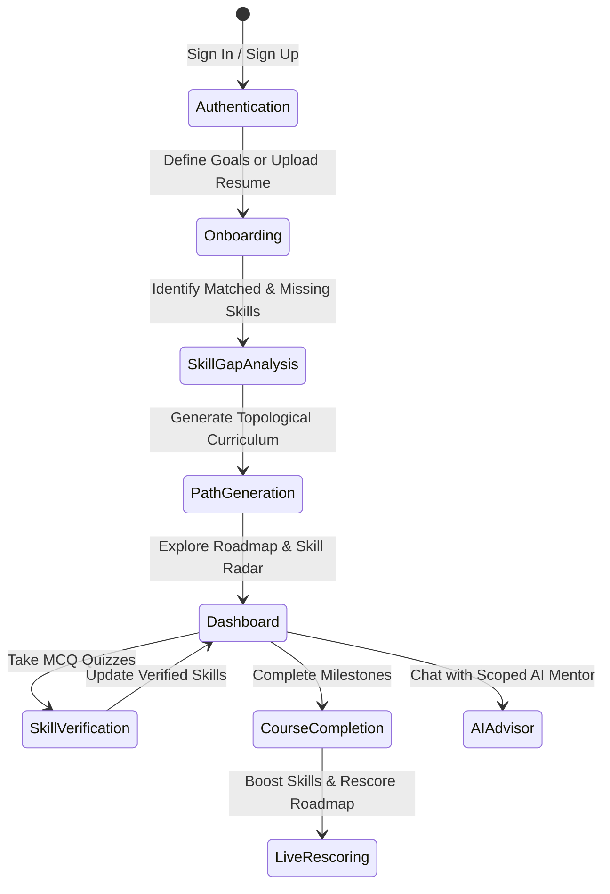

# LearnAI: Presentation Slide Deck (PPT Guide)

> **Prepared for Code Catalyst**  
> *Topic: LearnAI — An AI-Powered Adaptive Learning & Career Path Platform*  
> *Date: August 2026*

---

## 📽️ Slide 1: Title Slide

### **Header / Badge**: `LEARNAI · BY CODE CATALYST`
### **Title**: An AI-Powered Personalized Learning & Skill-Gap Platform
### **Subtitle**: Turning free-text career aspirations, resume uploads, and skill assessments into structured, explainable, and adaptive curricula — built on Supabase, pgvector, and Groq LLMs.
### **Footer**: `PROJECT OVERVIEW · AUGUST 2026`

---

## 📽️ Slide 2: The Problem

### **Category**: `THE PROBLEM`
### **Headline**: Generic course catalogs don’t know what you know — and leave career goals unstructured.

| 1. One-Size-Fits-All Catalogs | 2. Unstructured Aspirations | 3. Black-Box Recommendations |
| :--- | :--- | :--- |
| Learners scroll through hundreds of disconnected courses with no sense of pedagogical order, prerequisite validation, or individualized starting points. | *"I want to be an ML Engineer"* or *"I want to be a Criminal Lawyer"* never gets translated into concrete, measurable competencies. | Existing platforms recommend courses with zero explanation of *why* an item was selected, leaving learners unable to see their actual progression. |

---

## 📽️ Slide 3: The Solution

### **Category**: `THE SOLUTION`
### **Headline**: LearnAI turns goals and resumes into guided, verifiable, and explainable learning paths.



- **Describe Goal / Upload Resume**: Natural language goal input or `.pdf`/`.docx` resume parsing across CS & Non-CS domains.
- **AI Skill Extraction**: Scans against 100+ target roles and 4,480+ benchmarked skills in `role_skills.json`.
- **Topological Curriculum**: Courses ordered logically: *Foundations ➔ Core Skills ➔ Intermediate Mastery ➔ Capstone*.
- **Adaptive Evolution**: Skill proficiency boosts on course completion and server-side re-scoring of remaining milestones.

---

## 📽️ Slide 4: System Architecture

### **Category**: `ARCHITECTURE`
### **Headline**: A lean, serverless, and secure full-stack architecture.

- **Client Layer**: React 19, Vite 8, Tailwind CSS 4, React Router 7, Recharts (Radar & Mastery Graphs), PDF.js & Mammoth client-side parsing.
- **Data & Auth Layer (PostgreSQL + RLS)**: Supabase Auth with strict Row Level Security (RLS) on all user data, pgvector (384-dimensional cosine similarity).
- **Serverless Edge Layer**: 8 Deno/TypeScript Edge Functions handling semantic search, greedy path generation, quiz evaluation, and AI mentorship.
- **AI Intelligence Layer**: Groq LLM inference (`openai/gpt-oss-120b` / `llama-3.3`) providing sub-second goal parsing, quiz generation, and personalized path explanations.

---

## 📽️ Slide 5: Six Core Capabilities

### **Category**: `CORE FEATURES`
### **Headline**: Six integrated capabilities delivering one continuous learning experience.

1. **Conversational Goal Parsing**: Free-text career goals mapped to canonical skill taxonomies with zero hallucinations.
2. **Resume-Driven Skill Gap Analyzer**: Automated resume parsing extracting matched qualifications vs. missing gaps against 100+ roles.
3. **Personalized Learning Paths**: Topological curriculum curation combining vector semantic similarity with marginal skill-gap score.
4. **Interactive MCQ Skill Verification**: Dynamic 3-question quizzes generated per skill via Groq, graded server-side with zero client answer leakage.
5. **Adaptive Progress & Path Editing**: Real-time skill proficiency boosts upon course completion, paired with interactive **Edit Plan** course pruning.
6. **Context-Aware AI Mentor**: Scoped personal learning assistant referencing the learner's active target role, verified skills, and roadmap sequence.

---

## 📽️ Slide 6: The AI & Serverless Layer

### **Category**: `AI LAYER`
### **Headline**: Eight Supabase Edge Functions power every intelligent moment.

| Function | Operational Responsibility |
| :--- | :--- |
| **`parse-goal`** | Extracts target career, experience level, and known/weak skills from free text. |
| **`get-recommendations`** | Vector cosine similarity over course embeddings blended with skill-gap scoring. |
| **`generate-path`** | Greedy topological builder ordering courses into milestone-labeled sequences with AI rationales. |
| **`update-progress`** | Dynamically boosts learner skill proficiency upon course completion and re-scores remaining items. |
| **`generate-quiz`** | Generates dynamic 3-question multiple-choice verification assessments per skill via Groq. |
| **`submit-quiz`** | Evaluates quiz submissions server-side, logs attempts in `quiz_attempts`, and marks skills as assessed. |
| **`ask-assistant`** | Scoped conversational mentor that advises students based on their live profile and path status. |
| **`explain-path-item`** | Generates individual pedagogical rationales explaining why a specific course belongs in their path. |

---

## 📽️ Slide 7: Course Recommendation & Scoring Engine

### **Category**: `HOW SCORING WORKS`
### **Headline**: Every course receives a deterministic, explainable, and multi-factor score.

$$\text{final\_score} = 0.6 \times \text{similarity} + 0.4 \times \text{gap\_score}$$

$$\text{similarity} = 0.5 \times \text{track\_similarity} + 0.5 \times \text{semantic\_similarity} + \text{beginner\_bonus}$$

- **Track Similarity ($50\%$)**: Matches goal domain keywords (*e.g., Machine Learning, Frontend, Healthcare, Law*) to catalog tracks.
- **Semantic Vector Cosine Similarity ($50\%$)**: Local 384-dimensional deterministic embeddings matching goal semantics to course descriptions.
- **Skill-Gap Score ($40\%$)**: Quantifies the marginal improvement the course provides over the learner's existing competencies.

---

## 📽️ Slide 8: Multidisciplinary Domain Expansion

### **Category**: `MULTI-DISCIPLINARY TAXONOMY`
### **Headline**: Broadening beyond tech — native support for high-demand non-CS curricula.

```
┌─────────────────────────┬─────────────────────────┬─────────────────────────┐
│     Technology & AI     │   Healthcare & Medical  │     Law & Legal Ops     │
├─────────────────────────┼─────────────────────────┼─────────────────────────┤
│ • Machine Learning      │ • Human Anatomy         │ • Criminal Law          │
│ • Full-Stack Web Dev    │ • Clinical Surgery      │ • Corporate Contracts   │
│ • Cloud & DevOps        │ • Medical Ethics        │ • Legal Negotiation     │
└─────────────────────────┴─────────────────────────┴─────────────────────────┘
┌─────────────────────────┬─────────────────────────┬─────────────────────────┐
│  Engineering (Core)     │ Forensic Science & Psych│ Digital Economy & Media │
├─────────────────────────┼─────────────────────────┼─────────────────────────┤
│ • Civil Structural Eng  │ • Crime Scene Forensics │ • Digital Marketing     │
│ • Mechanical Systems    │ • Cognitive Psychology  │ • Growth Analytics      │
│ • CAD & Structural Sim  │ • DNA & Ballistics      │ • Creator Economy       │
└─────────────────────────┴─────────────────────────┴─────────────────────────┘
```

---

## 📽️ Slide 9: Data Model & Row-Level Security

### **Category**: `DATA MODEL`
### **Headline**: Strict relational modeling with Row Level Security (RLS) on all user data.



- **`learner_profiles`**: User metadata, career aspirations, and experience levels.
- **`skills` & `courses`**: Canonical catalog with 384-dim pgvector embeddings.
- **`learner_skills`**: Dynamic skill proficiencies categorized by source (`self-reported`, `inferred`, `assessed`).
- **`quiz_attempts`**: Server-side quiz session records, answers, and evaluation scores.
- **`path_items`**: Ordered curriculum sequence with milestone labels, scores, and status flags.

---

## 📽️ Slide 10: Complete Learner Journey

### **Category**: `USER JOURNEY`
### **Headline**: From initial aspiration to an evolving, verified career curriculum.



---

## 📽️ Slide 11: Conclusion & Impact

### **Category**: `SUMMARY & IMPACT`
### **Headline**: LearnAI — Growing a living, adaptive curriculum around every learner.

- **Outcome-Driven**: Bridges the gap between ambition and verifiable competence.
- **Explainable by Design**: Every recommendation, score, and milestone comes with explicit pedagogical reasoning.
- **Zero Hallucinations**: Grounded in structured course catalogs, canonical skill graphs, and validated multiple-choice assessments.

---

### **Thank You!**  
**Code Catalyst Team** · August 2026
